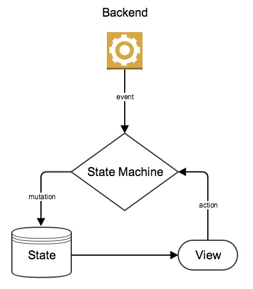

### Cross platform application development

As platform evolves, much more effort is invested by the IT industry to develop applications that works on different platforms, including the web, iOS and android. Even though each platform has its own restrictions or conventions, application developers still strives to provide consistent user experience across different platforms.

Attempts were made to relieve this problem. These solutions can be divided into three categories.

1. Based on web technologies, a.k.a webkit or webview.
2. Wrap native runtimes in a cross platform virtual machine or environment, e.g Xamarin, and RoboVM.
3. Create tools to translate code written for one platform to another platform, like j2objc.

However, most of these solutions have their own limitations or problems. A detailed survey of these approaches is accessible in a [blog series](http://www.skyscanner.net/blogs/developing-mobile-cross-platform-library-part-1-exploring).

### Every program is a state machine
This project tries to solve this problem using another approach. It applies a new architecture to enable reusing logic related code across platforms. This architecture is depicted in the following image.

(https://www.gliffy.com/go/publish/image/9255225/L.png)

It is motivated by the fact that every program is a state machine. The state machine is induced by business logic and view logic of an application.

1. As the *core* of an application, the **state machine** transform (mutate) states upon receiving user's actions from the front-end views, or events from the backend. In general, it is a set of handlers for each action and event. Javascript is chosen as the language to implement state machines, as it is good at event handling, and can be run on different platforms. Due to the purity of a state machine, we are able to reuse it everywhere.

2. The **state** of an application is a data store that contains all of its information and status, including temporary data for views. Regardless of its underlying database, it exposes data access interface similar to a hierarchical key-value store. All keys form a tree, which reflect their relations. A key is like a path of file systems, and have a parent or multiple children keys. Whenever a value is changed by the state machine, it sends a notification with its key to the view.

3. The **view** is *dump* but *reactive*. It must not contains any logic, it just monitors state, and render UI based on the state. When users interact with the view, it instantly sends predefined actions to the state machine. The view for each platform is written in its native language, leading to native user experience.

4. The **Backend** could be a remote server or local worker queues for long running tasks. It talks to **state machine** by asynchronous events. Local running tasks are written in C/C++ as both android and iOS support it. In addition, they should be network transparent, such that state machines are agnostic about where the tasks are executed. This allow us to execute some tasks in mobile devices, and some in remote servers.

As you can see, the data flow of the whole application is unidirectional, inspired by the Flux architecture.

### Benefit
- Deterministic states: all application states including view states are contained in a single store.
- Easy unit test and integration test: all business and view logic can be tested by supplying actions and events, without any touch of the view.

### Demo
To prove the above mentioned architecture works, a proof of concept application is developed. It is a simple counter with two buttons to increment and decrement the count. Currently there is only an android app of it, but we plan to develop iOS and web versions of it.

Note that the demo application depends on react native, which may confuse you. Actually react native is used as the javascript engine to implement the **state machine**. In addition, a react native module is created to implement the **state** (a simple key value store). React native is utilized to quickly prove the feasibility of this new architecture.

### Roadmap
- [x] Develop a proof of concept, and explain the architecture
- [ ] Collect feedback from the community
- [ ] Implement a cross platform javascript runtime
- [ ] Implement a unified data store for **state**
- [ ] Optionally add a C/C++ framework for backend tasks

Although this project is still in early stage, contribution is highly welcome.

### Notes
- The javascript runtime should be compatible to that in modern browsers, such that a **state machine** module can run cross platforms. *React native* is a good start for it.
- The data store for **state** should be compatible to IndexedDB, so that they are accessible when running in browsers. Good candidates of it are *LevelDB* and *RocksDB*.
